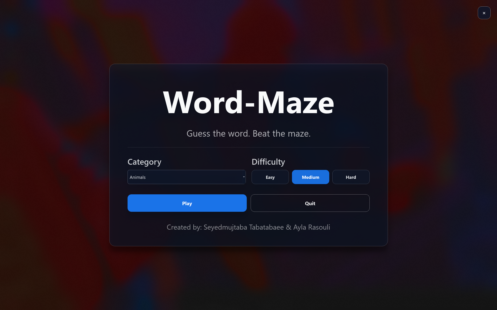

# Word-Maze (Demo)

A simple **word-guessing game demo** built with **PyQt5**, created as a **preview of the main Word-Maze project**.  
The demo focuses on basic gameplay mechanics and a modern glassmorphism-style UI using Windows blur effects.

Created by **Seyedmujtaba Tabatabaee** & **Ayla Rasouli**

---

## About the Demo
This project is a **demo / pre-release preview** of the main Word-Maze game.

- The player must **guess an English word**
- Words are **hardcoded**
- Word length is **variable**
- The demo represents an early version of the core idea and UI

---

## Platform
- **Windows 10 / 11 only**

> This demo relies on Windows-specific blur effects and has not been tested on other operating systems.

---

## Requirements
- **Python 3.10**
- PyQt5
- BlurWindow

---

## Installation

1. Make sure **Python 3.10** is installed and added to PATH  
2. Install dependencies:
```bash
pip install PyQt5 BlurWindow
```

## Run
cd <project-directory>
```bash
python Demo.py
```
## Screenshots




## Notes

This repository contains only a demo

It is intended for preview and demonstration purposes

Features may be incomplete or simplified compared to the main project
