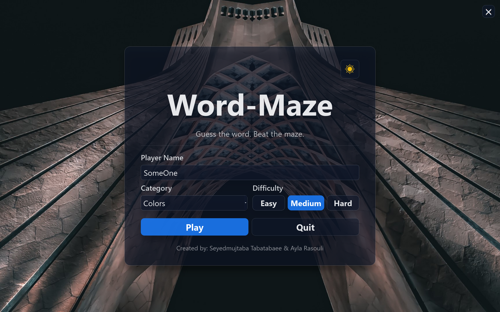
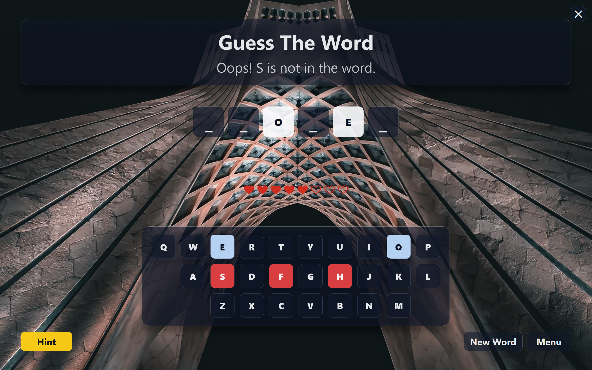

<div align="center">

# 🧩✨ **Word Maze**
### *A Polished PyQt5 Word Puzzle Experience*


**CS50 Final Project**  
Built with ❤️ using **Python** & **PyQt5**

[▶ Video Demo](#) • [⬇ Releases](https://github.com/Seyedmujtaba/Word-Maze/releases) • [📄 Documentation](docs/)

</div>

---

## 🚀 Introduction

**Word Maze** is a visually rich, desktop-based word puzzle game designed to challenge players’ vocabulary, logic, and memory.  
Players must uncover hidden words by selecting letters wisely while managing limited lives, difficulty levels, and score strategies.

This project demonstrates:
- Event‑driven GUI programming
- Structured game state management
- Persistent local data storage
- Clean separation of UI, logic, and assets

---

## 🎥 Video Demo
🎬 **CS50 Submission Video:** *([click](https://youtu.be/NKC_lIpcXSA?si=QVkyMZJo-L8RxoHJ))*

---

## 🌟 Highlights

✨ **Modern Desktop GUI** built with PyQt5  
🎯 **Category‑based random words**  
⌨️ **Interactive A–Z on‑screen keyboard**  
🌓 **Light & Dark themes**  
🧠 **Difficulty modes:** Easy / Medium / Hard  
💡 **Hint system**  
🏆 **Local leaderboard & score tracking**  
💾 **Persistent progress (JSON)**  

---

## 🎮 Gameplay Overview

| Mechanic | Description |
|--------|-------------|
| ❤️ Lives | Limited attempts per word |
| 🧩 Guessing | Select letters to reveal the word |
| 🎯 Scoring | +10 correct / –5 incorrect |
| ⭐ Bonus | +30 for perfect completion |
| 💡 Hint | Reveals one random letter |
| 🏁 End States | Win & Game Over screens |

---

## 📸 Visual Showcase

<details>
<summary><strong>🌞 Light Theme</strong></summary>

  


</details>

<details>
<summary><strong>🌙 Dark Theme</strong></summary>

  


</details>

---

## 🗂️ File Overview
A brief description of the main files and directories in the project.

### 🔹 Source Code (`src/`)
- **`main.py`** — Application entry point; initializes the game and launches the UI.
- **`ui_main.py`** — Handles UI layout and widget creation using PyQt5.
- **`game_state.py`** — Manages the current game state (word, guesses, lives, progress).
- **`logic_handler.py`** — Core gameplay logic; input handling, validation, and win/lose conditions.
- **`utils.py`** — Shared helper and utility functions.

### 🔹 Data (`data/`)
- **`words.json`** — Word lists and categories used in the game.
- **`save_data.json`** — Persistent storage for player progress, settings, and leaderboard data.

### 🔹 Assets (`assets/`)
- **`icons/`** — UI icon resources.
- **`themes/`** — Theme assets including colors, styles, and backgrounds.

### 🔹 Documentation (`docs/`)
- **`word-maze.pdf`** — Detailed project documentation and design description.
- **`README_images/`** — Images used within the README file.

---

## 🏗️ Architecture

```
Word-Maze/
├── assets/
│   ├── icons/            UI icons
│   └── themes/           Light & dark themes
│
├── data/
│   ├── words.json        Word lists & categories
│   └── save_data.json    Scores & leaderboard
│
├── src/
│   ├── main.py           App entry point
│   ├── main_window.py    UI controller
│   ├── game_state.py     State management
│   ├── logic_handler.py  Core game logic
│   └── utils.py          Shared utilities
│
├── demo/
│   └── Demo.py           Minimal demo
│
└── README.md
```

---

## ⚙️ Installation & Usage

### ▶ Windows (Recommended)
Download precompiled executables from:
👉 [Download Latest version](https://github.com/Seyedmujtaba/Word-Maze/releases)

### ▶ Run from Source
```bash
pip install PyQt5
python main.py

or

run run.bat
```

---

## 🕹️ How to Play

1️⃣ Launch the game  
2️⃣ Enter your player name  
3️⃣ Select category & difficulty  
4️⃣ Guess letters carefully  
5️⃣ Solve the word before lives run out  

---

## 🧠 Design Philosophy

- **PyQt5** chosen for advanced desktop GUI experience  
- **Event‑driven architecture** for responsive gameplay  
- **Persistent JSON storage** for progress & leaderboard  
- **Modular design** for maintainability and clarity  

---

## ⚠️ Limitations

- English language only  
- Static word categories  
- Local single‑player gameplay  

---

## 🔮 Future Roadmap

🚀 More word categories  
🎵 Sound effects & animations  
🌐 Online leaderboard  
📱 Cross‑platform packaging  

---

## 👥 Team

### 👩‍💻 [Ayla Rasouli](https://github.com/aylarasouli)
- Core game logic
- Word loader & dataset
- Progress management

### 👨‍💻 [Seyedmujtaba Tabatabaee](https://github.com/Seyedmujtaba)
- UI & main window
- Persistent save system
- Documentation & demos

---

## Author Contributions
  ### - [Ayla Rasouli](https://github.com/aylarasouli)
    src/progress_manager.py
    src/word_loader.py
    

  ### - [Seyedmujtaba Tabatabaee](https://github.com/Seyedmujtaba)
    README.md  
    Demo/Demo.py
    Demo/readmi.md
    src/main_window.py
    run.bat
    data/save_data.json
    src/main.py
    data/words.json

---

## 📜 License

This project is currently **unlicensed**.  
An open‑source license (MIT recommended) may be added.

---

<div align="center">

✨ *Designed with care. Built for challenge. Delivered for CS50.* ✨

</div>
